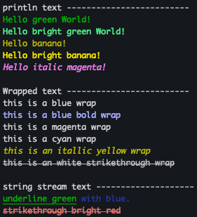

# Terminal Library

```
 ______                    _______                        _______    _______    
|      |.-----.-----._____|_     _|.-----.----.--------. |_     _|  |       |   
|   ---||  _  |  _  |______||   |  |  -__|   _|        |  _|   |_ __|   -   |__ 
|______||   __|   __|       |___|  |_____|__| |__|__|__| |_______|__|_______|__|
        |__|  |__|                                                              
```

A library to support terminal colors, attributes, cursor positions, screen sizes, etc.


## CMake Example

find_package(termio REQUIRED)

## Examples



_See [examples](examples) directory._

## Color Breakdown

_see [this](https://gemini.google.com/share/6b4aa67b2cb4)._

###### 2025.04.17 | dpw
